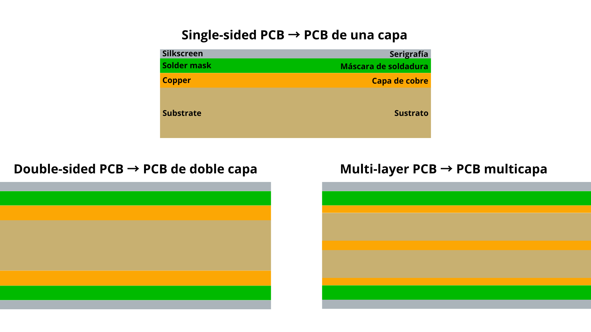
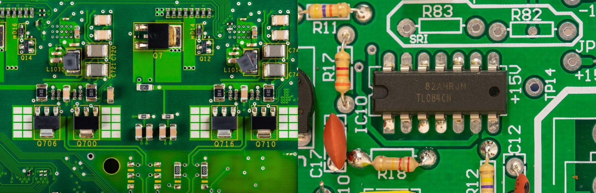
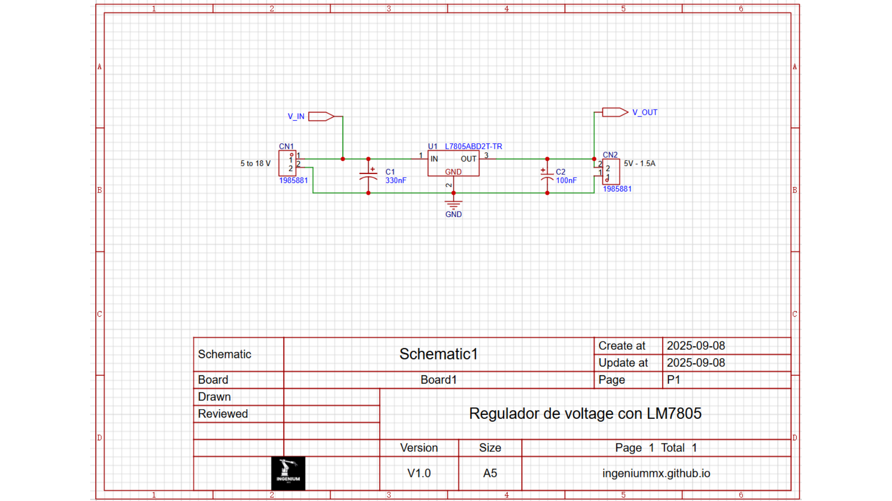
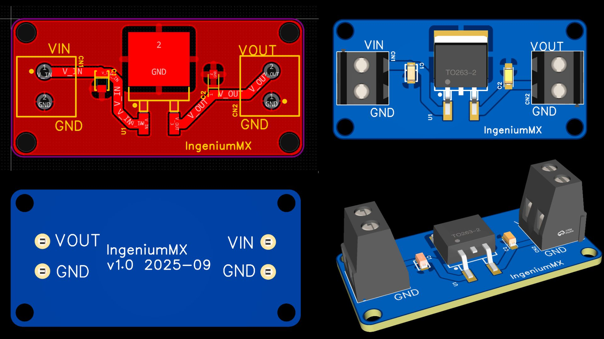

Si alguna vez has desarmado un dispositivo electrónico, seguramente te has encontrado con placas verdes o azules con componentes electrónicos.

El acrónimo **PCB** viene del inglés *Printed Circuit Board* y se traduce como **placa de circuito impreso**.  

En pocas palabras, una PCB es una **placa de fibra con pistas de cobre**. Estas pistas son cables planos que conectan los componentes entre sí de manera ordenada y confiable.  

Un PCB está formado por varias capas físicas:  
- **Sustrato (FR4)**: el material base que le da rigidez.  
- **Cobre**: las pistas conductoras.  
- **Máscara de soldadura**: la capa protectora, generalmente verde.  
- **Serigrafía**: texto blanco para identificar pines y componentes.  

### Tipos y componentes
Las PCBs se pueden clasificar de varias formas:

- **Número de capas**:  
  - **1 capa** → solo pistas en una cara de la placa.  
  - **2 capas** → pistas arriba y abajo, conectadas con pequeños agujeros metalizados llamados **vías**.  
  - **Multicapa** → varias capas internas de cobre, necesarias en equipos con circuitos más complejos.

  

- **Tipo de montaje de componentes**:  
  - **Through-hole (THT)** → los pines atraviesan la placa por orificios y se sueldan al otro lado.  
  - **Montaje superficial (SMD)** → los componentes se colocan directamente sobre la superficie en pads metálicos.  

  

### Software para diseñar PCBs

El diseño de una PCB empieza siempre en un **software CAD electrónico**. Algunas opciones comunes son:

- **EasyEDA** → gratis, funciona en navegador, muy práctico si estás empezando.  
- **KiCad** → open source y completo, usado tanto por makers como en proyectos profesionales.  
- **Altium Designer** → profesional, pero de pago.  

#### Pasos para diseñar una PCB

1. **Diseñar el esquemático**  
   Dibujas el circuito con **símbolos**, que son representaciones gráficas de cada componente (resistencias, chips, conectores).  
   Cada símbolo debe estar vinculado a una **huella (footprint)**, que define la forma física del componente en la PCB.  

  

2. **Pasar al editor de PCB**  
   Aquí defines el contorno de la placa y decides cómo distribuir las huellas de los componentes.  
   Después se comienza a enrutar las pistas. Estas conexiones pueden ir en la parte superior, inferior o en capas internas.  
   Para conectar un lado con otro, se usan **vías**.
  

  

3. **Generar los archivos Gerber**  
   Son los planos digitales que entiende la fábrica para producir la placa.  
   Puedes visualizarlos antes de mandar a fabricar en sitios como PCBWay.  

### Cómo mandarlas a fabricar

Hoy en día mandar a hacer PCBs es barato y rápido. Los pasos son:

1. Exporta los **Gerbers** de tu diseño.  
2. Elige un fabricante online (ejemplos: [JLCPCB](https://jlcpcb.com/), [PCBWay](https://pcbway.com/)).  
3. Sube tus archivos y configura las opciones. 
4. Paga y espera. En menos de dos semanas tendrás tus PCBs listas. 

---

### Reglas de diseño recomendadas

Además de los consejos básicos, estas reglas te ayudarán a evitar errores comunes:

1. **Define las reglas desde el inicio**  
   Configura en el software los valores deseados como: ancho de pista,  separación minima entre pistas, tamaño de vía ...  

2. **Coloca primero lo importante**  
   Pon conectores y componentes grandes en su lugar, luego los ICs principales y, alrededor, los pasivos.  
   Mantén los SMD en el mismo lado para simplificar montaje.  

3. **Usa un plano de tierra sólido**  
   En placas de 2 capas, dedica una cara a GND y enruta mayormente en la otra.  

4. **Agrupa por función**  
   Separa analógico, digital y potencia. Así reduces interferencias y facilitas el ruteo.  

5. **Revisa siempre con DRC/ERC**  
   Haz chequeos automáticos y una revisión manual antes de exportar los Gerbers.  

---

### Checklist antes de enviar a fábrica 

- [ ] ERC/DRC sin errores.  
- [ ] Footprints revisados con datasheets.
- [ ] Revisar orientacion y polaridad de LEDs, diodos y condensadores/capacitores
- [ ] Plano de GND continuo (sin islas).  
- [ ] Ancho de pistas suficiente para la corriente.  
- [ ] Textos legibles y fuera de pads.  
- [ ] Conectores orientados correctamente.  
- [ ] Mounting holes y test points definidos.  
- [ ] Gerbers revisados en el visor del fabricante.  
